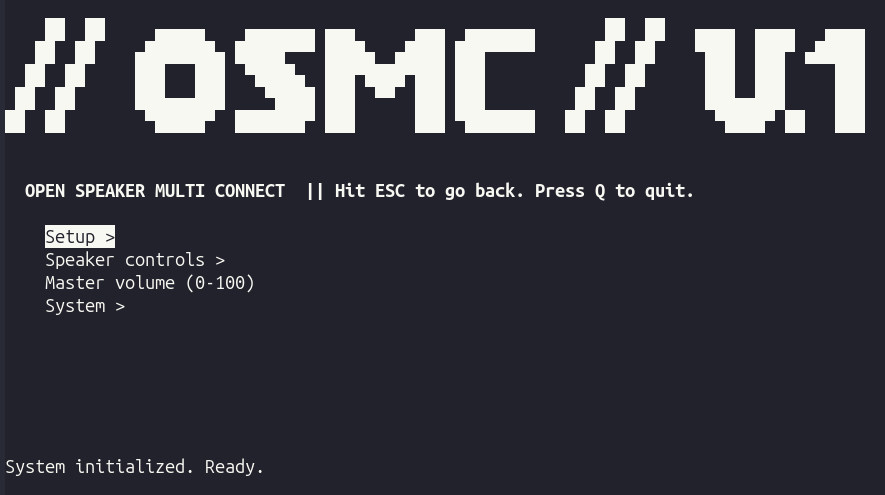

**Status: work in progress, not stable.**

A Python CLI tool for Linux (PipeWire + BlueZ) that connects multiple Bluetooth speakers at once and combines them into a single, synced audio output with per-speaker latency calibration.

## What it does

- Automates `bluetoothctl` trust / pair / connect for a set of known speakers
- Retries connections until they succeed (Bluetooth pairing is flaky)
- Maps connected devices to their PipeWire sink names via `pactl`
- Creates a combined audio sink so all speakers play the same stream
- Lets you tune per-speaker latency to correct sync drift between devices
- Provides a TUI (terminal UI) for controlling volume, latency, and connection state
- Persists speaker configuration (latency, volume) to a local JSON file

## Why

Bluetooth speakers introduce inconsistent latency compared to wired output. Combining multiple speakers into one sink without correction causes audible timing drift. This project automates the connection setup and lets each speaker's delay be tuned individually so everything plays in sync.

## Architecture

The project is split into four layers:

```
┌─────────────────────────────────────────────┐
│  main.py             (composition root)     │
│  Instantiates AudioManager, wires TUI       │
├─────────────────────────────────────────────┤
│  app/                 (orchestration)       │
│  use_cases.py  → connect_and_combine_all    │
│  workflows.py  → factory_reset,             │
│                   delete_speaker_state_file │
├─────────────────────────────────────────────┤
│  core/                 (domain layer)       │
│  bluetoothctl.py → BlueZ / bluetoothctl     │
│  audio_sinks.py  → PipeWire / pactl         │
│  speaker.py      → BluetoothSpeaker         │
│  audio_manager.py→ state (de)serialize      │
│  pactl.py        → pactl subprocess wrapper │
│  load_env.py     → .env parser              │
├─────────────────────────────────────────────┤
│  interfaces/          (presentation layer)  │
│  tui/engine.py    → curses menu engine      │
│  tui/presenter.py → menu config builder     │
│  web/             → (not built yet)         │
└─────────────────────────────────────────────┘
```

### How the audio pipeline works

When you run **Connect All & Combine**, the tool builds this PipeWire graph for every connected speaker:

```
┌──────────────────┐     ┌──────────────────┐     ┌─────────────────┐
│  module-null-    │────→│  module-loopback │────→│  Real Bluetooth │
│  sink (delayed)  │     │  latency_msec=X  │     │  speaker sink   │
└──────────────────┘     └──────────────────┘     └─────────────────┘
         │
         └─ All null sinks are slaves of ─→ ┌──────────────────────┐
                                            │  module-combine-sink │
                                            │  (default output)    │
                                            └──────────────────────┘
```

1. **Null sink** — A virtual sink that receives the combined audio stream.
2. **Loopback** — Bridges the null sink's monitor to the real Bluetooth speaker sink. The `latency_msec` parameter adds delay to fast speakers so they line up with slower ones.
3. **Combine sink** — Aggregates all null sinks into one master output. Your music player sees only this sink.

Because `module-combine-sink` does not support per-slave delay directly, the loopback in front of each real sink acts as the delay element.

Latency changes at runtime (`BluetoothSpeaker.set_latency`) mute the speaker, tear down its old loopback, load a new one at the requested delay, poll `pactl list sink-inputs` until that loopback is actually wired up, and only then unmute — this avoids audible pops/clicks when retuning.

## Requirements

- Linux with **PipeWire** and **BlueZ**
- Python 3
- `pactl` and `bluetoothctl` available in `$PATH`
- Bluetooth speaker MAC addresses configured in a `.env` file

## Configuration

All hardware addresses must be entered manually. There is no automated device discovery yet.

### Finding your hardware addresses

Your Bluetooth controller(s):

```
bluetoothctl list
```

Your speakers (put them in pairing mode first):

```
bluetoothctl scan on
```

### The `.env` file

Create a `.env` file in the project root:

```
# Controller used for audio output (speakers) and input (phone)
CONTROLLER_OUTPUT=AA:BB:CC:DD:EE:FF
CONTROLLER_INPUT=AA:BB:CC:DD:EE:FF

# Name of the combined sink (no spaces)
COMBINED_OUTPUT_SINK=multi_speaker_sync

# Speakers
OUTPUT_DEVICE_DIY_SPEAKER_1=AA:BB:CC:DD:EE:FF
OUTPUT_DEVICE_DIY_SPEAKER_2=AA:BB:CC:DD:EE:FF
OUTPUT_DEVICE_BOSE_SOUNDLINK=AA:BB:CC:DD:EE:FF

# Phone (used as audio input source)
INPUT_DEVICE_PHONE_IPHONE=AA:BB:CC:DD:EE:FF
```

Rules:

- Use `OUTPUT_DEVICE_...=MAC` for speakers.
- Use `INPUT_DEVICE_...=MAC` for input sources.
- `COMBINED_OUTPUT_SINK` must not contain spaces.
- Comment out unused lines with `#` instead of deleting them.
- Any key starting with `OUTPUT_DEVICE` or `INPUT_DEVICE` is picked up automatically — the suffix after that prefix is just a human-readable label and has no effect on behavior.

## Running the app

### Terminal UI (TUI)

```
./tui.sh
# or
python3 main.py --tui
```

The TUI is a keyboard-driven curses menu:

- **Arrow keys / j k** — Navigate
- **Enter** — Select
- **ESC / Backspace** — Go back
- **Q** — Quit
- Blocking tasks dim the menu and show a `[BUSY - PLEASE WAIT]` indicator.
- All output (including `print()` from core modules) is captured in the bottom log panel — `main.py` reassigns `builtins.print` to the TUI's `log()` function at startup so this works transparently across every module.

### Web UI

```
./web.sh
# or
python3 main.py --web
```

Not implemented yet — currently just prints a placeholder message.

## TUI menu structure

```
BLUETOOTHCTL Connect All & Combine
Speaker Controls
  └── Speaker: <name>
        ├── Set Latency (ms)      → prompts for integer
        ├── Set Volume (0-100)    → prompts for integer
        ├── Volume Up 10%
        ├── Volume Down 10%
        ├── Mute On
        └── Mute Off
Master Volume (0-100)
System
  ├── Full Factory Reset
  ├── Unload Modules
  ├── Unpair Bluetooth Devices
  └── Delete Speaker State JSON File
```

The menu tree itself is generic: `interfaces/tui/engine.py` turns any nested dict of labels → callables/submenus into a navigable curses menu, auto-detecting whether an action needs a str/int/bool prompt from its function signature. `interfaces/tui/presenter.py` is what actually builds the dict above for this app.

## State persistence

Speaker objects (latency, volume, module IDs) are saved to `speaker_state.json` in the project root. This allows the TUI to rebuild the speaker menu after a restart without re-running Bluetooth setup, as long as the PipeWire modules are still alive.

## Known limitations

- **Manual MAC discovery** — No scanning UI yet; all addresses must be in `.env`.
- **Hard-coded sleep** — `connect_and_combine_all()` sleeps 5 seconds after Bluetooth connection to give PipeWire time to create audio sinks. This is a reliability band-aid, not a proper readiness check.
- **No web interface** — The `--web` flag prints a placeholder.
- **Bluetooth reconnection** — If a speaker drops (battery dies, range loss), automatic reconnection is not yet robust.
- **pactl error handling** — `pactl` failures are not always surfaced clearly to the TUI log panel.
- **`is_combined_sink_active()` is a shallow check** — it only checks whether a sink with the configured name exists in `pactl list short sinks`, not whether it's actually backed by the currently connected Bluetooth devices. Flagged in the source as work in progress.

## File structure

```
open-multi-speaker-connect/
├── main.py                    # Entry point; composition root
├── app/
│   ├── __init__.py
│   ├── use_cases.py           # connect_and_combine_all — Bluetooth + sink orchestration
│   └── workflows.py           # factory_reset, delete_speaker_state_file
├── core/
│   ├── __init__.py
│   ├── audio_manager.py       # AudioManager — JSON state persistence, master volume
│   ├── audio_sinks.py         # PipeWire sink orchestration (null sink / loopback / combine)
│   ├── bluetoothctl.py        # Bluetooth trust/pair/connect logic
│   ├── load_env.py            # .env parser
│   ├── pactl.py                # pactl subprocess wrapper
│   └── speaker.py             # BluetoothSpeaker domain class
├── interfaces/
│   ├── tui/
│   │   ├── __init__.py
│   │   ├── engine.py          # Generic curses menu engine
│   │   └── presenter.py       # Builds this app's TUI menu config
│   └── web/
│       └── __init__.py        # (placeholder, not implemented)
├── .env                        # Your hardware MACs (not in git)
├── speaker_state.json          # Runtime state (not in git)
├── tui.sh
├── web.sh
├── .gitignore
├── LICENSE
└── README.md
```

## License

MIT License
